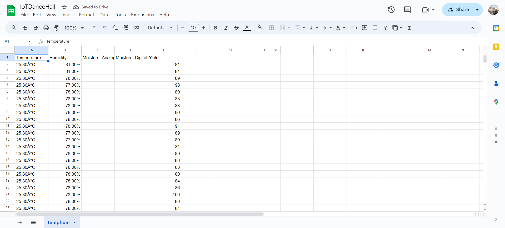

# IoT-Based Environmental Monitoring System

This project involves an IoT-based monitoring system using an ESP8266 NodeMCU to read temperature, humidity, and soil moisture data from sensors and log the data to a Google Sheet. The system helps provide real-time environmental data to farmers, enhancing crop productivity.

## Components Used

- ESP8266 NodeMCU
- DHT11 Temperature and Humidity Sensor
- Soil Moisture Sensor (Analog and Digital)
- Breadboard and Jumper Wires

## Description

### Google Apps Script

A Google Apps Script is used to handle incoming data from the ESP8266. It appends the data to a Google Sheet and provides a custom menu for clearing the data.

### ESP8266 Code

The ESP8266 NodeMCU reads data from the DHT11 and soil moisture sensors. It then sends the data to the Google Apps Script via HTTP POST requests, which logs the data in a Google Sheet.

## Setup Instructions

1. **Google Apps Script Setup**:
   - Open Google Sheets and go to `Extensions > Apps Script`.
   - Create a new script and paste the provided Google Apps Script code.
   - Deploy the script(code.gs) as a web app and obtain the deployment URL.

2. **ESP8266 Setup**:
   - Connect the DHT11 sensor and soil moisture sensor to the ESP8266 NodeMCU.
   - Configure the ESP8266 code with your WiFi credentials and the deployment URL from the Google Apps Script.
   - Upload the code(nodemcu.ino) to the ESP8266 using the Arduino IDE.

## Running the Project

1. Power up the ESP8266 NodeMCU.
2. The ESP8266 will connect to the WiFi and start reading sensor data.
3. The sensor data will be sent to the Google Sheet via the Google Apps Script.
4. Monitor the Google Sheet to see the logged data.

## Project Images

### Google Sheet Log

### Circuit Diagram

## Troubleshooting

- Ensure the Google Apps Script is correctly deployed and the URL is accurate.
- Verify that the ESP8266 is connected to the WiFi.
- Check the serial monitor in the Arduino IDE for any error messages.

